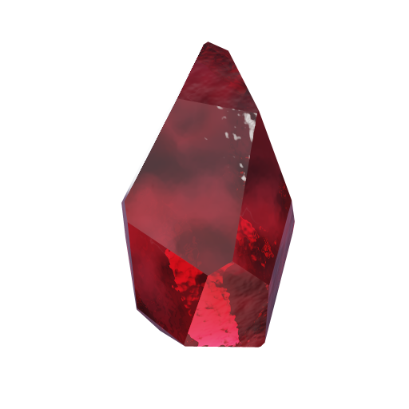

<p align="center">
  
</p>

<h1 align="center">Garnet</h1>

<p align="center">A Minecraft: Java Edition server written in Rust.<br>
Mods in any language, a built-in web admin panel, proximity voice chat, anti-cheat, and zero-config setup.</p>

---

Garnet targets the current Minecraft release (26.3, protocol 777). It downloads the official server jar on first start and pulls packet ids, block states, registries and tags out of it with Mojang's own data generator, so bumping to a new Minecraft version is a config change, not a code change.

## Quick start

Download a release binary (or `cargo build --release -p garnet-server`) and run it in an empty folder:

```
garnet
```

First start takes about a minute: it writes `garnet.toml`, downloads the Minecraft server jar and a Java runtime, extracts the game data, generates a world and prints a link to set up the admin panel. Then connect on port 25565 and open `http://localhost:8080` for the panel.

### Docker

```
docker run -it -p 25565:25565 -p 25565:25565/udp -p 8080:8080 -v ./data:/data ghcr.io/garnet-mc/garnet-server
```

or `docker compose up` with the included `docker-compose.yml`. Everything lives in the mounted `data` folder.

## Features

- **Current Minecraft version** – protocol 777 / 26.3, with the game data extracted from Mojang's jar rather than hand-copied tables.
- **Vanilla-compatible saves** – worlds are stored in Anvil region files with block names, plus `level.dat`, `playerdata/`, `ops.json`, `whitelist.json` and `banned-players.json` in the vanilla formats. Saves survive version bumps; a rename table maps old block names to new ones.
- **Mods in any language** – sandboxed WebAssembly mods with a small JSON API (events in, actions and queries out). A Rust SDK is included; anything that compiles to wasm32 works.
- **Web admin panel** – dashboard, live console, players, bans and whitelist, mods, config editor, audit log, backups and panel users, with owner/admin/moderator/viewer roles that are independent of in-game op. Opped players get a one-time login link with `/panel`.
- **Proximity voice chat** – a UDP relay with a spatial index; the client mod does the 3D audio.
- **Anti-cheat** – server-side speed, fly, reach, packet-flood and chat-flood checks with decaying violation points, rubber-banding, kicks and temporary bans.
- **Built for many players** – one task per connection, no global lock, packets encoded once per broadcast, chunk packets cached, chunk generation and disk I/O off the tick loop.
- **Operations** – RCON, scheduled zip backups with pruning, atomic saves, audit log, Velocity and BungeeCord forwarding, connection throttling, loud config errors.

## Configuration

`garnet.toml` is written with comments on first start; `garnet default-config` prints it. The panel's config page edits and validates it. See [docs/configuration.md](docs/configuration.md).

## Writing mods

See [docs/mods.md](docs/mods.md). The short version:

```rust
use garnet_sdk::*;

struct Hello;

impl Mod for Hello {
    fn init(&mut self) {
        register_command("hello", "Say hello", None);
    }
    fn on_event(&mut self, event: Event) -> EventResult {
        match event {
            Event::PlayerJoin { uuid, name } => {
                send_message(uuid, &format!("&aWelcome, {name}!"));
                EventResult::default()
            }
            Event::Command { command, .. } if command == "hello" => {
                broadcast("&dHello!");
                EventResult::cancelled()
            }
            _ => EventResult::default(),
        }
    }
}

garnet_mod!(Hello);
```

Build with `cargo build --release --target wasm32-unknown-unknown`, put the `.wasm` and a `mod.toml` in `mods/<id>/`, and reload from the panel.

## Layout

| Crate | What it does |
|---|---|
| `garnet-protocol` | Packets, NBT, text components, compression and encryption |
| `garnet-data` | Downloads the jar and Java, runs the data generator, loads the reports |
| `garnet-world` | Chunks, terrain generation, Anvil region files |
| `garnet-api` | The mod-facing event/action/query types |
| `garnet-mods` | The WebAssembly mod runtime |
| `garnet-admin` | The web panel (HTTP API and embedded UI) |
| `garnet-voice` | The voice relay |
| `garnet-server` | The server itself: networking, players, commands, tick loop |

## Status

Garnet is early. Players can join, see the world (with real sky and block lighting), move, chat and break blocks; the vanilla command set ([docs/commands.md](docs/commands.md)), mods, the panel, voice relay and anti-cheat work. Inventories, mobs, redstone, combat and vanilla terrain generation are on the roadmap ([docs/roadmap.md](docs/roadmap.md)).

## License

MIT.
